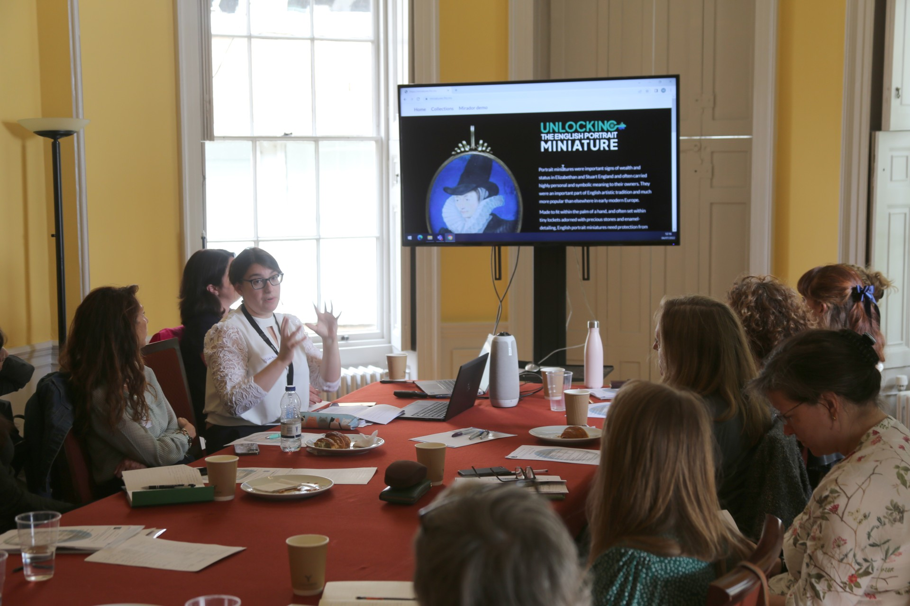
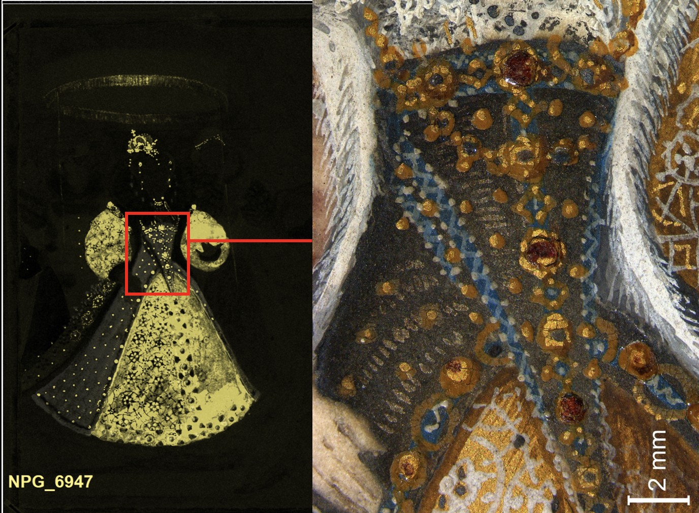
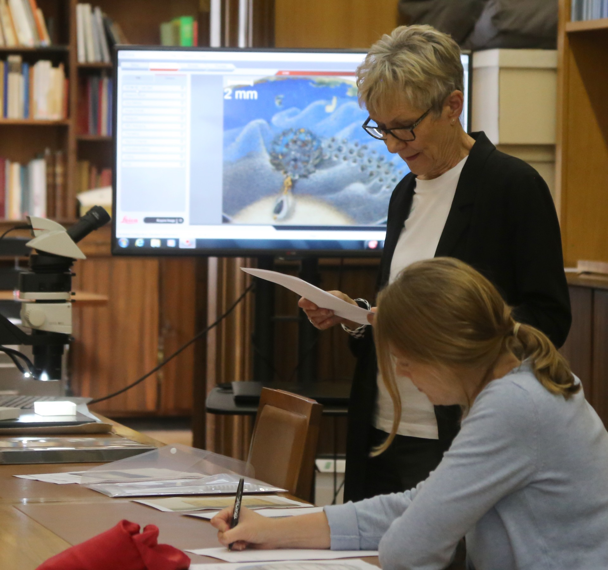
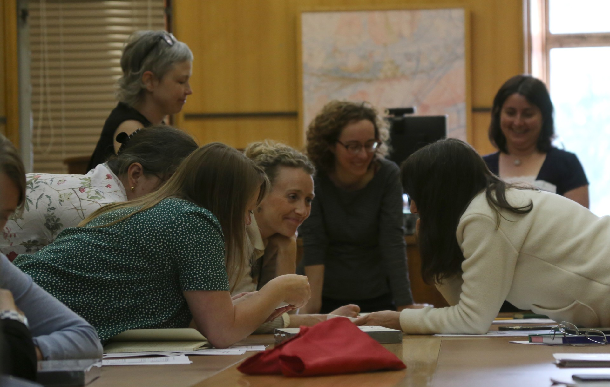

*Figure 1. Megan Bushnell (Digital Content Producer) explains the rationale, content and interactive features of the ‘Unlocking the English Portrait Miniature’ web resource.*

After years of research, the Unlocking the English Portrait Miniature project team were thrilled to host a day-long roundtable workshop at the Fitzwilliam Museum on 4 July 2022. Ten experts from the UK and abroad joined us to hear about the progress made and discuss preliminary findings from our extensive analytical campaign. After the delays and challenges of recent years, it was particularly enjoyable to hold the event without the need to wear masks or socially distance - both measures that would have made close inspection and conversation about the miniatures very challenging indeed!

The event also gave us the first opportunity to share this digital resource with miniatures scholars, who provided essential feedback on its initial content and layout. We also proudly showcased the first results of XRF scanning of miniatures, carried out using our recently acquired instrument. This analytical technique can provide us with distribution maps of the chemical elements that make up the paint scheme in each of the miniatures, which in turn informs us about the pigments used. During the workshop, we used the National Portrait Gallery’s recently acquired cabinet miniature of Elizabeth I and the Three Goddesses as an example of just how much information these maps got us. We were able to identify a range of different blue pigments for specific paint passages across the miniature, including the cobalt-based glass pigment smalt. The XRF instrument also detected the oxidised silver used on Elizabeth’s splendid costume. The silver detailing is now blackened and very difficult to make out, but the silver-distribution map shows how it would have made the bodice and outer skirt shimmer next to the gilding on the sleeves and inner skirt (Figure 2).

*Figure 2. A detail of the XRF map for gold on Elizabeth I and the Three Goddesses (NPG 6947) next to a microphotograph of Elizabeth’s jewel-studded bodice.*

In addition to XRF scanning results, we also showed a selection of comparative technical images captured from the nearly one hundred miniatures analysed over the course of the project. Unlike XRF scanning, X-radiography is a traditional imaging technique, but it has not often been used on miniatures. The X-ray images brought out interesting differences in the amount of lead white used in the fleshtones of different miniatures, a difference not evident through visual observation. This allows us to group works according to variations in painting technique, which may relate to the work of different artists. 

Cecilia Rönnerstam, miniatures conservator and researcher at the Nationalmuseum in Stockholm which houses 5,700 miniatures, most of them not well known outside of Sweden, introduced the group to the collection she has cared for since 2000. She spoke about her current research project on Elias Brenner’s 17th century colour chart, a unique source on the materials of miniature painting.

*Figure 3. Susan Sloman shares information from her unpublished catalogue on the Thomson collection miniatures with a detail of the portrait miniature of Mrs Cam (AGO.29376) on the monitor behind her. You can explore this miniature in detail here.*

In the afternoon, the event moved to the Graham Robertson Study Room, where a selection of miniatures on loan to the Fitzwilliam Museum for our project were available for close inspection and viewing under magnification. Susan Sloman, art historian and author of the forthcoming catalogue of the Thomson Collection miniatures (Figure 3), introduced us to the ten Thomson miniatures analysed for the miniatures project, which had travelled to Cambridge from the Art Gallery of Ontario in order to undergo analysis. These miniatures, and those kindly lent by the Duke of Buccleuch, were studied and discussed in detail by the participants, who relished the opportunity to view these works up close (Figure 4).

The day finished with a presentation by Catharine MacLeod, Curator of 17th century portraits at the National Portrait Gallery, who gave us a preview of the new display of the NPG’s miniatures to be revealed at the Gallery’s reopening in 2023. She drew on lessons learned and visitor responses to the 2019 exhibition Elizabethan Treasures: Miniatures by Hilliard and Oliver to consider how to display miniatures to optimal effect in a gallery setting. The ensuing discussion touched on the role of digital aids for the interpretation of portrait miniatures both in a gallery setting and online, the challenges of supplying physical means of magnification for the audience, and the limitations posed by the light sensitivity of these fragile art objects. Catharine’s talk resonated with our own thinking behind the initiative of creating a virtual resource dedicated to providing optimal access to the intricacies of miniatures.

*Figure 4. Roundtable participants and hosts pour over miniatures for a rare viewing and lively discussion on examples normally housed in overseas or private collections.*
