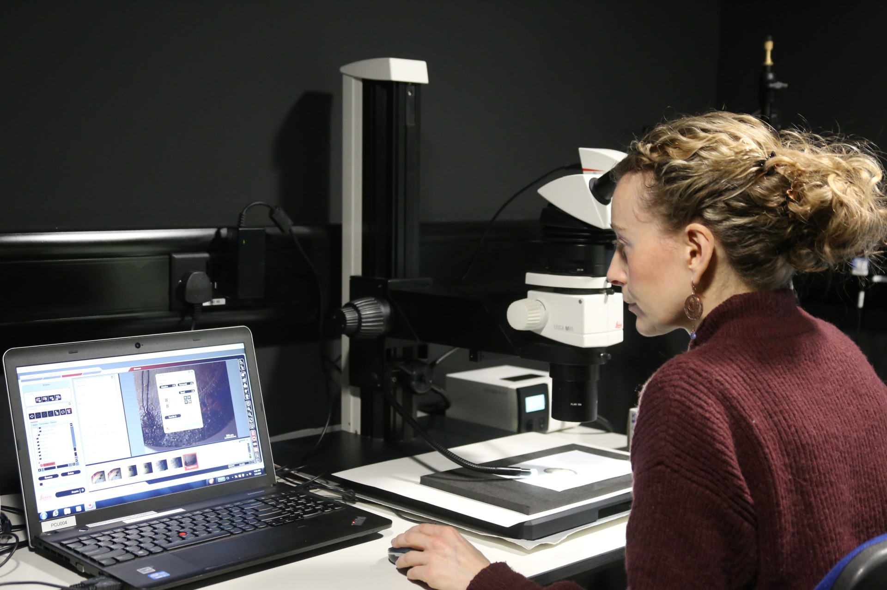
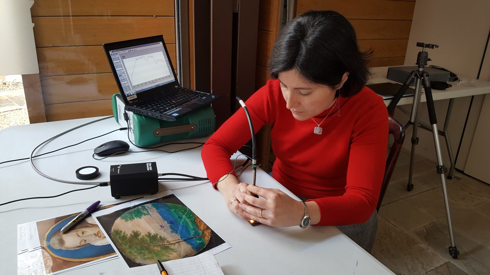

The ‘Unlocking the English Portrait Miniature’ web resource is a key outcome of six years of technical research work on 16th and 17th century miniatures from a number of collections in the UK and abroad. Our aim with this resource is to provide an unprecedented level of access to the artworks showcased here, by sharing high-quality images and recently discovered information about their materials.

Project team:

- Christine Slottved Kimbriel: Senior Painting Conservator (Co-principal investigator, 2019-ongoing)
- Paola Ricciardi: Senior Research Scientist (Co-principal investigator, 2019-2022)
- Flavia Fiorillo: Research Scientist (2020-ongoing)

With support from:

- Amanda Bluck: Projects Coordinator, Research (2020-2022)
- Megan Bushnell: Digital Content Producer (2021-2022)
- Lindsey Cox: Research Assistant (2019)
- Nathan Daly: Research Scientist (2022)
- George Doji: Computer Associate (2019-2021)
- Steven Flack: Administrator (2022-ongoing)
- Alex Gushurst-Moore: Research & Impact Coordinator (2022-ongoing)
- Dan Pett: Head of Digital and IT (2019-2022)
- Jo Vine: Head of Research and Impact (2019-ongoing)
- Avishi Vashisht: Trinity College project intern (2023)
- Olivia Warren: Digital and IT Coordinator (2021-2022)

The project team owes sincere thanks to numerous other colleagues at the Fitzwilliam Museum and the Hamilton Kerr Institute for their support on many fronts throughout the duration of the project.

*Figure 1: Microphotography of a miniature is undertaken in the analytical lab of the Fitzwilliam Museum. You can browse micrographs of all the miniatures featured on this site.*

### Background:

The project was conceived in 2017, during a collaboration between Christine Kimbriel and Paola Ricciardi on the National Trust cabinet miniature of Lord Herbert of Cherbury, attributed to Isaac Oliver. This iconic cabinet miniatures was investigated using an extensive analytical protocol, initially developed for the examination of illuminated manuscripts, in order to learn more about its condition and material composition. While the project resulted in [extensive new knowledge about the miniature](https://www.nationaltrustcollections.org.uk/article/a-closer-look-at-the-cabinet-miniature-of-lord-herbert-of-cherbury), it was disappointing to find a very limited body of comparable published research with which to contextualise our findings. We found that Isaac Oliver’s oeuvre (c.1565-1617) has received significantly less attention than that of his contemporary, Nicholas Hilliard (1547-1619).

*Figure 2: Fibre-optics reflectance spectroscopy (FORS) taking place on a miniature at Burghley House.*

This inspired an initial pilot study, Secrets of a Silent Miniaturist, funded by the Cambridge Humanities Research Grant Scheme, undertaken in 2018–19. The project approached Isaac Oliver from a technical angle through a study of his working methods, techniques and use of materials as evidenced in approximately ten attributed works, mainly from the Fitzwilliam Museum collection. The pilot, although limited in scope, confirmed the potential of the cross-disciplinary approach and expanded analytical methodology (see ‘[Our Research Explained](/research)’) and revealed in great detail what paint media and pigments are present in the examined miniatures, and how they were utilised to accomplish highly refined results. It also clarified questions about later interventions and deterioration phenomena, which on such a small scale can be extremely difficult to chart with the naked eye!

Following the pilot study, some highlights of which were published in a [special issue of British Art Studies](https://www.britishartstudies.ac.uk/issues/issue-index/issue-17/secrets-of-a-silent-miniaturist), we have received further funding from the British Academy/Leverhulme Small Research Grant Scheme, the Fitzwilliam Museum Marlay Group and David Thomson. This has allowed us to carry on with the technical research on a greatly expanded group of miniatures from 2019 until 2022. [Initial steps](https://conservation.fitzmuseum.cam.ac.uk/cataloguing-and-digitising-the-jim-murrell-archive/) have also been taken towards the digitisation of the [Jim Murrell Archive](https://www.hki.fitzmuseum.cam.ac.uk/archives/jimmurrell) housed at the Hamilton Kerr Institute. While the archive is not featured in full on this web resource, archive entries pertaining to specific miniatures are available on the relevant objects’ pages.

## Resource content and contributing institutions:

This online resource features the technical images and our interpretation of analytical results generated during the initial pilot study, as well as during the further analytical campaign, and will ultimately include close to one hundred miniatures. While the main focus has been on miniatures attributed to, or associated with, Isaac Oliver, the resource holds examples attributed to other artists as well, including Lucas Horenbout, Nicolas Hilliard, Peter Oliver, John Hoskins and Jacob van der Doort.

Several institutions have granted access to their miniatures for the purposes of this research. They include the Fitzwilliam Museum (UK), Burghley House (UK), The National Trust (UK), The Buccleuch Collection (UK), The Royal Collection (UK), The National Portrait Gallery (UK), Statens Museum for Kunst in Copenhagen (Denmark), Nationalmuseum in Stockholm (Sweden) and The Ken and David Thomson Collection at the Art Gallery of Ontario (Canada). We are grateful to all these institutions for their willingness to let miniatures from their collections be included in this research initiative.

We hope that the approach to the documentation and technical investigation of miniatures exemplified on this resource might inspire other collections to take a similar approach. The resource is expandable, and can host technical information and images generated by others, but equally, the IIIF-enabled viewer allows for content from other sources to be pulled in for a side-by-side comparison. This means that a miniature in the resource can be viewed next to images of miniatures or other artworks pulled from other IIIF-enabled online collections.
