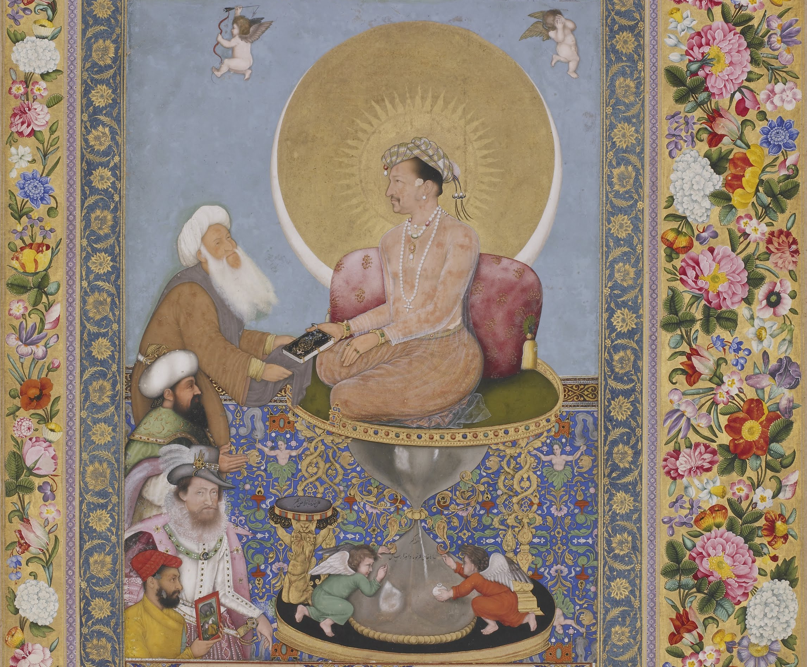
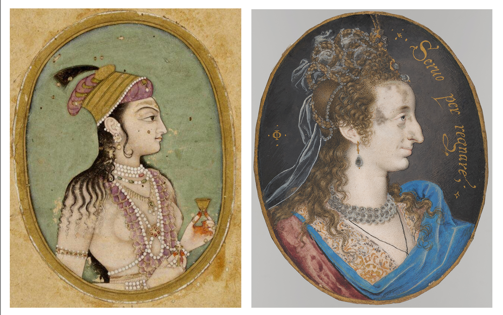
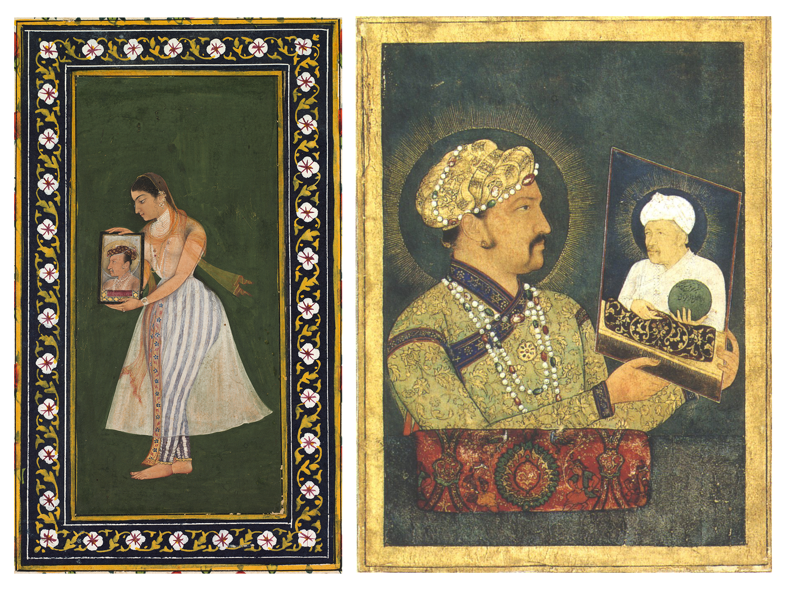
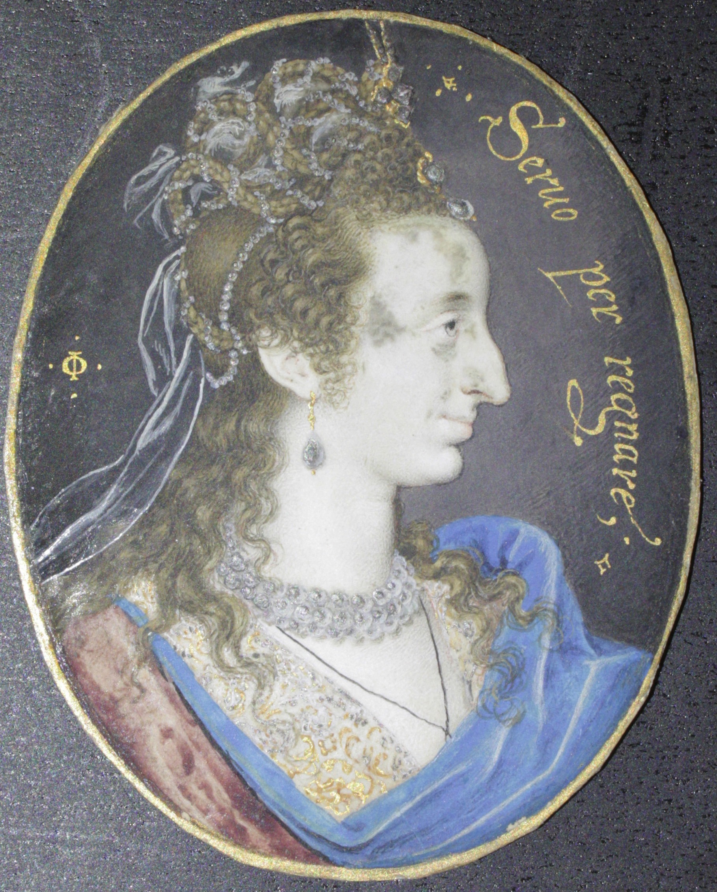
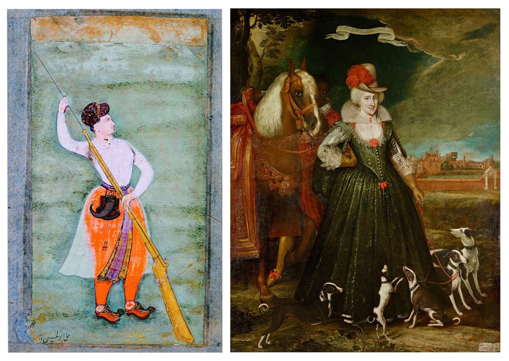

### A Comparative Analysis of the Political and Aesthetic Intentions Behind the Miniatures of Nur Jahan and Anne of Denmark

*By Avishi Vashisht*

In this blog-post, we explore how – through the vehicle of portraiture executed mainly in the miniature medium – two extraordinary women of the early 17th century used their patronage of talented artists to help fashion and expand, in sophisticated ways, their considerable individual powers alongside their royal husbands.

On the 13th of July 1616, the court of Padshah Jahangir anxiously awaited the results of an unpremeditated but pivotal artistic competition between East and West, between India and Britain. The prestige of Timuriya artistry and, by extension, the very credibility of the wealthiest monarch in the world were on the line: could the Timuriyas actually surpass Britain in the art of ‘limning’ or miniature-painting? The British ambassador to India, Sir Thomas Roe, had made the boastful claim that a ‘Pikture of a frend’ in his possession would surpass in beauty, grace, form, and arrangement any miniature produced by an Indian artist<a href="#fn1" id="ref1">1</a>. 

The claim had a precipitous effect and an affronted Jahangir immediately summoned his ‘Cheefe Paynter’ along with four of his greatest court-artists. A few days later – so we are informed by Roe’s detailed journals – six identical miniatures were placed before Roe. Five were Indian reproductions and one was Roe’s original – the Isaac Oliver miniature on which he had placed his wager. His challenge was to find, by candlelight, this miniature from amongst Jahangir’s copies.

*Fig.1. Bichitr, Jahangir Preferring a Sufi Shaikh to Kings, 1615-18 (detail), Freer Gallery of Art (F1942.15a).* Note the self-portrait of Bichitr (holding a self-portrait) in the bottom left corner. Above him, James I of England after a John de Critz portrait is depicted.

In his accounts, Thomas Roe repeatedly reduces India to a kind of seductive heathendom – extravagant in its debauchery, fuelled by an alcoholic king’s drunken hospitality, and somehow also the centre of the world. This, he states in a letter addressed to King James I, dated 29 January 1615: “it cannot be denied that this King is one of the mightiest Princes in Asia, as well in extent of territory as in revenue; equall to the Turke, far exceeding the Persian.”<a href="#fn2" id="ref2">2</a>

Like other merchants and diplomats from Europe, Roe had arrived at Surat in 1615 in the hopes of obtaining formal agreements for untaxed, bilateral trade between Britain and India and, on a personal level, to make a name for himself. Yet, he was doomed to fail at this overly ambitious goal since Britain was only a meagre province for the Timuriyas and they did not regard it with much respect. King James I, on the other hand, had been eager to tap into the renowned stores of textiles, gold, semi-precious stones, spices and ‘Curiosityes’ that exotic ‘Indya’ could offer, necessitating Roe’s diplomatic mission to Jahangir’s court. Since British exports offered nothing desirable or rare enough to appeal to the already spectacularly wealthy India, Thomas Roe found himself resorting to provocation and cajolery to get Jahangir’s attention and his account of the limned picture of his female acquaintance should be understood in this context.

As curious Indian courtiers craned their necks to catch a glimpse of the six miniatures, Roe proceeded to study each one carefully. Initially, he hesitated; which was Isaac Oliver’s unmistakable masterpiece and which the Indian facsimile? But soon enough, the Englishman picked out his miniature and won the bet, later calling Jahangir’s chief painter “a foole” for thinking he could equal European talent.<a href="#fn3" id="ref3">3</a>

Today, it is evident that Thomas Roe regarded India and Europe – with Britain at its heart – as two antithetical forces in perennial conflict. India was not even a civilisation in his estimation, no matter how wealthy or well-connected it was.<a href="#fn4" id="ref4">4</a> Although Britain was unable to counter Indian success in the global exchange of commercial artefacts, for Roe, it remained nobly humble and superior to the Timuriya Empire through Christian virtuousness.<a href="#fn5" id="ref5">5</a> Contrary to Roe’s inimical stance which positioned the two nations as discordant poles, the developments that both the British and Timuriya schools of art underwent during this period demonstrate a heightened sensitivity to the aesthetic expressions of ‘other’ contemporary traditions. For example, frequent representations of chubby, playful putti and Mariological crowns in Timuriya court paintings evoke divinity and recurring depictions of vibrant and swirling Persianate flora in Tudor paintings evoke splendour. These were the results of increasing globalisation in the 16th and 17th centuries.<a href="#fn6" id="ref6">6</a>,<a href="#fn7" id="ref7">7</a> The art of ‘limning’, as the Tudors and Stuarts called it, is an especially potent example of this indirect artistic cross-pollination which employed comparable media and methods to achieve the intensely colourful, matt surfaces of these minute depictions. Even though the miniatures of India and those of Britain receive special attention in their own right, they are generally studied independently of each other. 

In my essay, therefore, I would like to bring to the forefront two remarkable women of the early 17th century – both queens and patrons of innovative artists, who skilfully wielded portraiture ‘in the little’ to create visual expressions of their politically charged personages: Nur Jahan (1573-1645), the empress of India and Jahangir’s most beloved wife, and Anne of Denmark (1574-1619), the queen-consort of James I. 

*Fig.2 (left). Unknown artist, Empress Nur Jahan Begam, (IM.37-1912).&#169;V&A.* 

*Fig.3 (right). Isaac Oliver, Anne of Denmark, 1610, Royal Collection Trust (RCIN 420025).&#169;Fitzwilliam Museum. (See more images of this miniature [here](https://unlocking-miniatures.fitzmuseum.cam.ac.uk/object/rcin-420025))*

While Jahangir remained in the throes of a constant addiction to opium and alcohol, James I’s ineptitude in leading the Protestant English court had been apparent from the onset.<a href="#fn68" id="ref8">8</a>, Jahangir lost the rich and strategic province of Kandahar to Safavid rivals<a href="#fn9" id="ref9">9</a>, and James I’s alliance with Catholic Spain had resulted in country-wide resentment. It was within this context that their queens consolidated personal regal autonomy to a surprising extent. 

As the daughter of Sophie of Mecklenburg-Güstrow, a German princess and the Queen of Denmark and Norway, Anne of Denmark was intensely aware of her noble lineage. The miniatures she commissioned clearly state this. Isaac Oliver, with his much more Continental style, was her chosen miniaturist over Nicholas Hilliard, who was instead favoured by her husband, James I, as he had been by Elizabeth I. In a particularly striking example in the Royal Collection Trust,<a href="#fn10" id="ref10">10</a> we see a diamond-studded ‘S’ jewel prominently placed on Anne’s ruff, and a ‘C’ enveloping the number ‘IV’. The letters of the alphabet doubtlessly represent her mother, Queen Sophie, and brother, King Christian IV. The message is clear: this woman is not merely an appendage to James I; this is a queen proudly proclaiming her continental lineage.

Nur Jahan, on the other hand, was born a commoner, with the birth-name Mehr-un-Nissa or ‘beguiling woman’. Her father, Mirza Ghiyas Beg, was an Iranian refugee at Agra, which plays into her tale as one coloured by controversy and breaking with tradition. Although thirty-four years old and estranged from her first husband when she first met Jahangir, the legend goes that the emperor fell madly in love with the Iranian merchant selling her wares in Meena Bazaar (the annual women’s market). Right until Jahangir’s death, Nur Jahan’s influence depended entirely on the status she had gained through her marriage. Through history she comes down to us as his twentieth and most influential wife, but our comprehension of the extent of her power in the empire and over its Timuriya leader has only recently been recognised.<a href="#fn11" id="ref11">11</a>

Deeply conscious of the anonymity of her birth as well as of her Iranian roots – which could be seen by many to be a sign disloyalty due to Safavid Iran’s constant rivalry with the Timuriyas – Nur Jahan made the utmost of her position as favourite consort. Through her artistic patronage, she worked hard to build her public image as one possessing authority. Jahangir’s chronic inebriation, combined with his love of botany, zoology and connoisseurship of painting and music, meant that delights of the soul were given more attention than the necessities of business, military defence, and diplomacy. This negligence provided an opportunity for his ambitious queen to command the empire. 

At the apex of her supremacy, Nur Jahan was consigning assignments to Timuriya ships, issuing ‘firmans’ or imperial edicts in her own seal, signing commercial treaties with international diplomats, leading hunting expeditions on holidays and amassing lucrative properties in her name. The emperor of India was inert, his throne alive only in paintings, and his true heir-apparent, Prince Khurram, was duly banished to the Deccan, i.e. southern India, in order to remove the potential threat he embodied.<a href="#fn12" id="ref12">12</a>

*Fig.4 (left). Bishandas, Nur Jahan holding a portrait of Jahangir, c.1627. &#169;The Cleveland Museum of Art*

*Fig.5 (right). Mir Hashim, Abu al Hasan, Emperor Jahangir With a Portrait of Akbar, his father, 1600-15. (OA 3676 B Recto ; OA 3676 b).&#169;2016 RMN-Grand Palais (musée du Louvre) / Mathieu Rabeau*

An Indian ‘miniature’ in the Cleveland Museum of Art encapsulates this authority-shift.<a href="#fn13" id="ref13">13</a> In it, we view a lone Nur Jahan standing barefoot. There is neither marble, nor sand underneath her delicate feet. Her soft ankles are clad with ‘ghungroo’, or dancing bells. In her hands rests the portrait of a powder-faced Jahangir, whose deliberately whitened moustache is a declaration of old age and the torpor of submission to death. Antithetical to her husband’s depiction, Nur Jahan’s neck is draped in loop upon loop of pearls, symbolising regal youth. The ‘dupatta’ that covers her torso for modesty (perhaps made of Dakkai muslin – the finest in the world – much of whose trade she supervised) is enticingly translucent, while her small lips, sharp nose and lotus-eyes are framed by jet black ringlets of hair. As she gazes reverently at Jahangir’s visage, the impact is one of incomparable, ethereal beauty and authority: his entire person is contained between her two hands and *she* is the future of the Timuriya House.

It is impossible to separate politics from art when it comes to Nur Jahan. This portrait borrows directly from an earlier one of Jahangir’s, within which he too held his dying father’s image to indicate his right to the throne.<a href="#fn14" id="ref14">14</a> Nur Jahan’s portrait was completed in 1627, by which time Jahangir needed ever-increasing doses of opium to carry out his daily-tasks, even suffering from withdrawal symptoms like shivering when he resisted the drug. The time is thus perfect to portray the queen’s own ‘right’ to inherit the throne by casting herself in the role of the successor to the throne. Much like her overseas counterpart, Nur Jahan was fascinated by the power that art could symbolically signify.<a href="#fn15" id="ref15">15</a>

*Fig.6. Isaac Oliver, Anne of Denmark, 1610, Royal Collection Trust (RCIN 420025). &#169;Fitzwilliam Museum. (See more images of this miniature [here](https://unlocking-miniatures.fitzmuseum.cam.ac.uk/object/rcin-420025))*

Though both women were portrayed in idealised ‘masques’, Isaac Oliver’s Anne of Denmark retained her strong, individualistic features; it is clear from his miniatures that she had a prominent, hooked nose.<a href="#fn16" id="ref16">16</a> The queen’s features were not conventionally beautiful, which is why her repeated portrayal in a fashion that highlighted both the uniqueness of her face and the material wealth she commanded ultimately exalted these imperfections. Since these limned portraits were bestowed upon court-favourites, the acceptance of this new trend was not to be questioned. The receiver could only praise that which was presented.<a href="#fn17" id="ref17">17</a> This contrasts with Nur Jahan’s depictions, which prized eternal youth in a bid for legitimacy and longevity not dissimilar to that of Queen Elizabeth I of England in her mask of youth as ‘the Virgin Queen’, as expressed in numerous portraits of her late reign.<a href="#fn18" id="ref18">18</a>

*Fig.7 (left). Abul-Hasan Nasiruz Zaman, Nur Jahan holding a gun, 17th century, &#169;Rampur Raza Library*

*Fig.8 (right). Paul van Somer, Anne of Denmark and a groom, 1617, &#169;Royal Collection Trust (RCIN 405887)*

There is, however, much in common between the two queens’ understanding of the potency of art. In the Rampur Raza Library resides an astonishing miniature called ‘Nur Jahan Holding a Gun’. We see that the queen has tied her hair and tucked it completely inside a turban. In Jahangir’s style, she wears baloony ‘pyjamas’. Unlike in the previous portrait, her jewels recede into a kind of insignificance. The focus of this picture is not youth as expressed by lithe beauty. Rather, she shows herself to possess manliness and extreme confidence. She proudly displays her musket, which travels the entire length of the composition. Her gaze is turned upwards in a fearless gesture, as she seems to contemplate the best strategy to tackle any rival. After all, legends of the queen’s expertise as a shooter and hunter abounded in Timurid India. It was believed, for instance, that she once slayed four tigers with only six bullets.<a href="#fn19" id="ref19">19</a> Such unabashed pride at her mastery of a sport a supposedly masculine sport seems to be the subject of this portrait.

We find a parallel in Paul van Somer’s large-scale portrait of Anne of Denmark in hunting costume surrounded by her dogs, finished in 1617.<a href="#fn20" id="ref20">20</a> When framed, it measures 287.5 by 231cm, with the scale of this portrait speaking to its theme. Anne of Denmark, in three-quarter profile, looks right at us with an assertive gaze. The deep teal sky seems to rumble as clouds crowd behind her. She wears practical leather-gloves meant for hunting and riding, as if they were an ornament unto themselves and indeed, they are turned into ornaments of ability and control, much more significant than a display of delicately draped pearls accentuating her femininity and wealth. Her right arm rests on her waist with her elbow jutting out in a gesture more commonly adopted by men. She controls her five greyhounds with a single leash, as the unleashed ones crowd around her, looking up at their queen adoringly. Their collars are emblazoned with her initials ‘AR’ (Anne Regina) to embolden her ownership of them. A groom of African descent – who notably wears the livery of her mother’s House of Oldenburg and not that of the House of Stuart – is made to gaze submissively at her from behind her horse’s head. An owl, a symbol of wisdom associated with the goddess, Athena, is perched on a branch in the distance. A scroll bearing the inscription, ‘LA MIA GRANDEZZA DAL ECCELSO’ ('My greatness is from on high'), floats directly above the queen’s head. Her husband and children are entirely absent from this scene, which shows her to be in possession of power and wealth via divine grace and her own illustrious lineage.

In conclusion, I have compared two remarkable queens who lived in opposite ends of the known world in the early 17th century. Further, I have attempted to draw out the striking similarities between them, such as the manner in which they pushed the boundaries of female power and jurisdiction, illustrating in particular, how the queens’ patronage of art as an expression of their autonomy surpasses the considerable gulf of cultural difference between them, ultimately uniting them as glorious historical personages. 

<ins>REFERENCES</ins>

1. Roe, Thomas and Foster, William. The Embassy of Sir Thomas Roe to the Court of the Great Mogul, 1615-1619: As Narrated in His Journal and Correspondence. Volumes I-II / Edited by William Foster. 1st. ed. 2017. Hakluyt Society. Second Ser. Web, vol. 1. pp. 212-3.<a href="#ref1" title="Jump back to footnote 1 in the text.">↩</a>

2. *Ibid.*, p. 120.<a href="#ref2" title="Jump back to footnote 2 in the text.">↩</a>

3. *Ibid.*, p. 214.<a href="#ref3" title="Jump back to footnote 3 in the text.">↩</a>

4. *Ibid.*, p. 113. Roe deems “Mogoll” India ‘the dullest, basest place that ever I saw and maketh me weary speaking of it’, before hoping for an expedited return to England.<a href="#ref4" title="Jump back to footnote 4 in the text.">↩</a>

5. Brown, Michael J., *Itinerant Ambassador: The Life of Sir Thomas Roe*, University Press of Kentucky, 2014, p. 40.<a href="#ref5" title="Jump back to footnote 5 in the text.">↩</a>

6. Branfoot, Crispin, *Portraiture in South Asia since the Mughals: Art, Representation and History*, I.B. Tauris & Company Limited, 2018, ProQuest Ebook Central, https://ebookcentral.proquest.com/lib/cam/detail.action?docID=5739282. pp. 86-7.<a href="#ref6" title="Jump back to footnote 6 in the text.">↩</a>   

7. King Edward VI, by 'workshop associated with Master John', NPG 5511: https://www.npg.org.uk/collections/search/portrait/mw07313/King-Edward-VI  (https://www.npg.org.uk/collections/search/portrait/mw07313/King-Edward-VI)<a href="#ref7" title="Jump back to footnote 7 in the text.">↩</a>

8. Mathew, David. "James I". Encyclopedia Britannica, 27 Dec. 2023, https://www.britannica.com/biography/James-I-king-of-England-and-Scotland. Accessed 14 February 2024."<a href="#ref8" title="Jump back to footnote 8 in the text.">↩</a>>↩</a>

9. Britannica, The Editors of Encyclopaedia. “Jahangir of India”, https://www.britannica.com/place/India/The-composition-of-the-Mughal-nobility, Accessed 14 February 2024.<a href="#ref9" title="Jump back to footnote 9 in the text.">↩</a>

10. Anne of Denmark (1574-1619), c.1611-12 (https://www.rct.uk/collection/420041/anne-of-denmark-1574-1619)<a href="#ref10" title="Jump back to footnote 10 in the text.">↩</a>

11. Eaton, Richard M.. India in the Persianate Age: 1000–1765, Berkeley: University of California Press, 2019. https://doi.org/10.1525/9780520974234. pp. 247-49.<a href="#ref11" title="Jump back to footnote 11 in the text.">↩</a>

12. *Ibid.*, pp. 250-1.<a href="#ref12" title="Jump back to footnote 12 in the text.">↩</a>

13. {{cite web|title=Nur Jahan Holding a Portrait of Emperor Jahangir|url=https://www.clevelandart.org/art/2013.325|author=Bishandas|year=c. 1627|access-date=23 January 2024|publisher=Cleveland Museum of Art}}. Indian miniatures show extreme variety in dimensions; this one of Nur Jahan’s, for example, is 13.6 x 6.4 cm (5 3/8 x 2 1/2 in.), with the entire page being 30 x 22.1 cm (11 13/16 x 8 11/16 in.)<a href="#ref13" title="Jump back to footnote 13 in the text.">↩</a>

14. https://collections.louvre.fr/en/ark:/53355/cl010327537<a href="#ref14" title="Jump back to footnote 14 in the text.">↩</a>

15. Lal, Ruby, "Empress: The Astonishing Reign of Nur Jahan". New York, NY: W.W. Norton & Company, 2018. Reproduced: colour plate after p. 142.<a href="#ref15" title="Jump back to footnote 15 in the text.">↩</a>

16. https://unlocking-miniatures.fitzmuseum.cam.ac.uk/object/rcin-420025<a href="#ref16" title="Jump back to footnote 16 in the text.">↩</a> 

17. Hughes, Heather A., ‘‘MASQUED’ IDENTITY AT THE STUART COURT: ISAAC OLIVER’S MASQUING PORTRAIT OF ANNE OF DENMARK’, 2014. https://www.cini.it/wp-content/uploads/2014/04/06_Hughes_69-83_WEB.pdf. pp. 78-9.<a href="#ref17" title="Jump back to footnote 17 in the text.">↩</a>

18. An example of this type of depiction of Elizabeth I (FM 3761), when she would have been in her mid-60s, can be seen at the Fitzwilliam Museum: https://data.fitzmuseum.cam.ac.uk/id/image/media-848365483<a href="#ref18" title="Jump back to footnote 18 in the text.">↩</a>

19. Richard M. Eaton, p. 247.<a href="#ref19" title="Jump back to footnote 19 in the text.">↩</a>

20. Anne of Denmark (1574-1619) and a Groom Signed and dated 1617: https://www.rct.uk/collection/405887/anne-of-denmark-1574-1619-and-a-groom<a href="#ref20" title="Jump back to footnote 20 in the text.">↩</a> 

