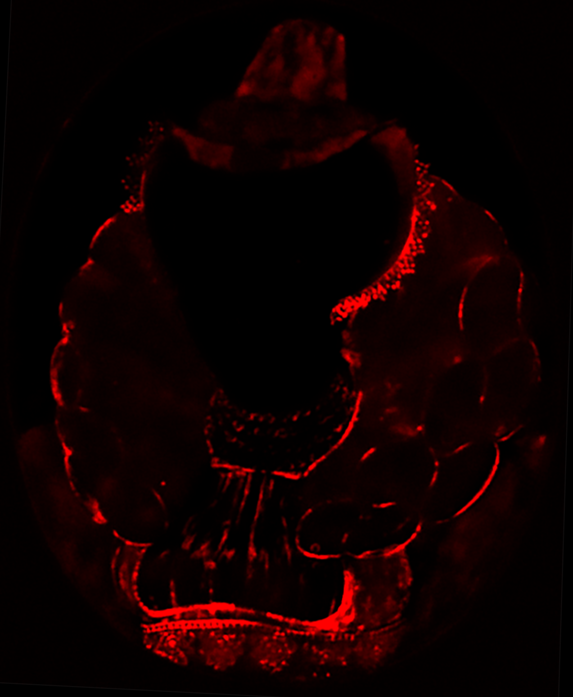
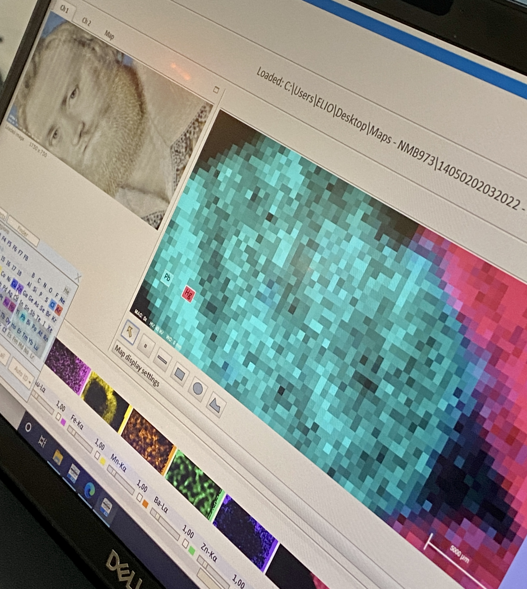

## Mercury White Used as a Pigment in Portrait Miniature by Isaac Oliver
*Cecilia Rönnerstam, Tom Sandström, Magnus Mårtensson*

*Fig.1. Miniature of Henry Danvers, Earl of Danby (1573–1644), (NMB 973) under the microscope at the Nationalmuseum, Stockholm in February 2022.*

**Background**

As part of the ongoing research project “Unlocking the English Portrait Miniature”[1](#[1]) initiated by the Fitzwilliam Museum in Cambridge, a small number of portrait miniatures by Isaac Oliver (d. 1617) in the collection of the Swedish Nationalmuseum were examined in Stockholm in the winter of 2022. In order to maximise the non-invasive analytical protocol, a collaboration with the Swedish Heritage Laboratory[2](#[2]) was organised which greatly augmented the portable analytical equipment brought from the UK.[3](#[3]) While the overall results of the analysis undertaken on the Nationalmuseum miniatures confirmed that Oliver used pigments that were well-known within late 16th century portrait miniature painting in England, an art form known as *limning* at the time, one of the miniatures unexpectedly revealed the extensive use of a white pigment made from mercury, which has to date only been identified once before in a portrait miniature. 

*Fig.2. Henry Danvers, Earl of Danby (1573–1644) (NMB 973). ©C.Kimbriel*

*Fig.3. Henry Danvers, Earl of Danby (1573–1644) (NMB 974). ©C.Kimbriel*

The portrait is one of two showing the same man with brown hair and beard, painted on a blue azurite background with Oliver’s characteristic monogram in gold.[4](#[4]) Probably painted in the late 1590’s, the sitter is believed to be either Henry Danvers, Earl of Danby (1573–1644) or George Clifford, 3rd Earl of Cumberland (1558 – 1605).[5](#[5])  While he is portrayed wearing a beautifully embroidered shirt in one of the miniatures, the other shows him in black with a tall hat in which the modelling of the beautiful black velvet is a reminder of the skilful handling of black to render the fabric in the garments of Three Brothers Browne which he painted in 1598. The sitter’s features and pose look almost identical in the two pictures. This may point to Oliver using templates for recurring sitters, as previously noted with other works examined during the research project, in a similar manner as his having prepared ‘tablets’ in different shades of flesh tone to choose from when starting a portrait.[6](#[6])  

**Surprising finds**

Where white was depicted in portrait miniatures during Elizabethan times it would usually be painted with a lead white pigment, sometimes called ceruse and known to artists since antiquity.[7](#[7]) When carefully prepared, as described in both Nicholas Hilliard’s unpublished manuscript *The Arte of Limning*[8](#[8]) (c.1600) and Edward Norgate’s *Miniatura or the Art of Limning*[9](#[9]) (1648), the pigment could be used to different effects; from thin washes such as the base layer for the carnation to the voluminous lace ruffs that Hilliard put much effort into, modifying the paint to have so much body that it gave the illusion of a real, starched textile and cast its own shadow. 

*Fig.4. Henry Danvers, Earl of Danby (1573–1644) (NMB 973), micrograph detail of collar in raking light, mercury white (or mercury chloride)
©C.Kimbriel*

*Fig.5. Henry Danvers, Earl of Danby (1573–1644) (NMB 974), micrograph detail of collar in raking light, lead white (or lead carbonate) ©C.Kimbriel*

Upon analysis of the two Nationalmuseum miniatures, however, while the pigment used for the collar above the black costume was indeed lead white as expected, the one in the embroidered shirt version surprisingly turned out to be a white pigment made from mercury. The find being unexpected, at least for some of us, reading through Hilliard’s listed pigments in his manuscript on limning showed that he actually mentioned, in passing, that there was indeed a white made from “quicksilver”. This, he writes, was good for painting fine lines, just as suggested by the distribution of it in the mercury MA-XRF distribution map of the Fitzwilliam Museum’s *Unknown Lady* (FM3868) where mercury white was first identified.[10](#[10])  

*Fig.6. MA-XRF elemental map of the mercury distribution in *Unknown Lady* (FM 3868). See more maps and images of this miniature [here](https://miniatures-mirador.fitzmuseum.cam.ac.uk/?manifestId[]=https://miniatures-iiif.fitzmuseum.cam.ac.uk/FM%203868/manifest.json)*

*Fig.7. Detail of *The Three Brothers Browne* (MIN0054), Isaac Oliver, 1598, Burghley House Collection, ©C.Kimbriel*

According to Hilliard, it was used by “women painters”, which were not in fact female artists but women wearing it on their faces as make-up. The effects of this on women’s health was commented on by the contemporary physician Richard Haydocke (c.1569-1642), who refers to the corrosive form of this mercury-chloride compound as “sublimate”.[11](#[11]) In fact, it was Haydocke who suggested that Hilliard write *The Arte of Limning*. A non-corrosive version of this compound was commonly used as medicine at the time and was defended by another art-interested person of the period: the famous royal physician Theodore Turquet de Mayerne (1573-1655). De Mayerne was later —and most likely incorrectly—attributed with the coining of its modern name: ‘calomel’.[12](#[12]), [13](#[13])   

**Thoughts on Oliver’s use of the pigment**

In comparing the collars of the two Nationalmuseum miniatures under the microscope and using a raking light to capture the surface texture of the paint, the mercury white (NMB 973) appears to have a barely noticeable greyish tone to it (calomel is sensitive to blackening both from exposure to light and alkali), and the paint can be seen to have considerably less body than the lead white. This is consistent with Hilliard’s description of a paint used specifically for drawing fine lines. However, based on the appearance of the application, Oliver may have attempted to apply the paint thickly, as if it had body, which has caused the brush strokes to dry up with uneven edges. In consequence, the finished result has a rutted, sunken appearance compared to the lead white in the other version (NMB 974). The comparison between two renditions of the same lace detailing perfectly illustrates the different handling properties and behaviour of these two white pigments. Perhaps Oliver wanted to give the lace a subtly different character? While we can’t know Oliver’s reasons for choosing to use mercury white for the collar in this miniature, its discovery adds to the existing evidence showing that Oliver occasionally, and probably knowingly, chose this pigment over the much more commonly used lead white. As more miniatures are analysed, we may learn that Oliver’s contemporaries also employed this unusual material for miniature painting, and a pattern of use may eventually become evident, which would shed further light on its unique properties and the reasons for its use instead of lead white. 

*Fig.8. MA-XRF scanning in action using the Bruker Elio XRF scanner. ©C.Rönnerstam*

<u>REFERENCES</u>

[1] Fitzwilliam Museum, Cambridge, FM 3868, [Unlocking the English Portrait Miniature](https://unlocking-miniatures.fitzmuseum.cam.ac.uk)

[2] Heritage Laboratory | Riksantikvarieämbetet (raa.se) Project ID: Dnr: RAÄ-2019-2238.

[3] Paola Ricciardi, Unpublished technical report on NMB 973, The Fitzwilliam Museum, 1.3.2023. While the Fitzwilliam brought a FORS and a Bruker Elio XRF scanner, the Heritage Laboratory contributed with a B&W Tek Raman 785 nm laser equipped with a probe and microscope, a Bruker ARTAX 800 micro XRF equipped with a polycapilary lens for pigment identification, and a General Electric Eresco 42MF4 X-ray unit and CRxFlex digital scanner for radiographic imaging.

[4] The antique art of writing in gold, including polishing the letters with animals’ teeth, was originally known as *chrysography*. Instructions on how to do it can be found in every text on illumination since the early Middle Ages. The tradition for writing in gold was continued in the first independent portrait miniatures painted in France and England in the 1520’s. It was by no means an invention by Hilliard as sometimes claimed in the literature.

[5] While the sitter in the two portrait miniatures (NMB 973 and NMB 974) was registered as George Clifford 3rd Earl of Cumberland in the Nationalmuseum’s inventory of Hjalmar Wicander’s (1860-1939) donation in 1927, along with a note saying they were first acquired from England by the Swedish art dealer A-B. H. Bukowski’s in 1921, Catharine MacLeod recently suggested that the sitter is more likely to be Henry Danvers, Earl of Danby (1573–1644). (see Catharine MacLeod, "Isaac Oliver and the Essex Circle", British Art Studies, Issue 17, 2020, https://doi.org/10.17658/issn.2058-5462/issue-17/cmacleod 

[6] The painting support used for limning was vellum, very thin parchment that needed to be stuck to a card to prevent cockling while painting, sometimes called a tablet. Edward Norgate wrote that “Mr Hillyard and his rare disciple, Mr Isaac Olivier (…)” had several tablets ready prepared with a first thin layer of flesh colour to choose from for each sitter. *Edward Norgate - Miniatura or the art of limning*, Jeffrey M. Muller and Jim Murrell (eds), Paul Mellon Centre for British Art, Yale University Press, 1997, p. 67-69.

[7] The terms white lead and ceruse have been used interchangeably in written sources on illumination since antiquity, in both cases meaning lead white (lead carbonate). See Muller and Murrell 1997 note 329 about Hilliard’s and Norgate’s changing terms.

[8] Nicholas Hilliard, *The Arte of Limning*, R.K.R. Thornton and T.G.S. Cain (eds), Carcanet Press, 1992.

[9] *Edward Norgate - Miniatura or the art of limning*, Jeffrey M. Muller and Jim Murrell (eds), Paul Mellon Centre for British Art, Yale University Press, 1997.

[10] Crippa, M., Legnaioli, S., Kimbriel, C.S., Ricciardi, P., ”New evidence for the intentional use of calomel as a white pigment”, *Journal of Raman Spectroscopy*, volume 52, issue 1, 2021, pp.15-22.

[11] Richard Haydocke wrote about this as an addition to his translation of Giovanni Paolo Lomazzo’s A Tracte Containing the Artes of Curious Paintinge Carvinge and Buildinge (1598), as has already been noted in Christine S. Kimbriel and Paola Ricciardi, ”Secrets of a silent miniaturist: findings from a technical study of miniatures attributed to Isaac Oliver”, British Art Studies issue 17, 2020, https://doi.org/10.17658/issn.2058-5462/issue-17/kimbrielricciardi

[12] Richard M. Swiderski, *Calomel in America: Mercurial Panacea, War, Song and Ghosts*, Brown Waler Press, 2008.

[13] Jennifer Schmid, “Beautiful Black Poison: The History of Mercury as a Medicine in America, The Weston A. Price Foundation, *Wise Traditions*, vol.9, number 2, summer 2009, p.17-31. 

