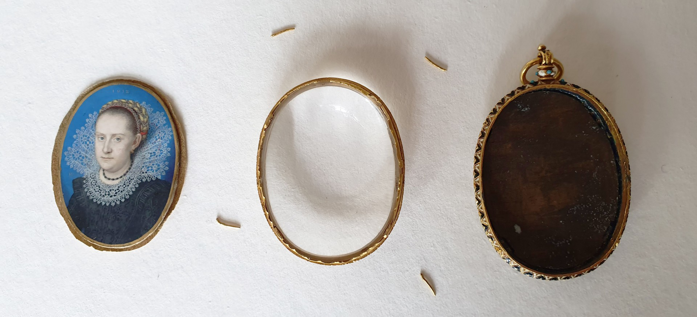
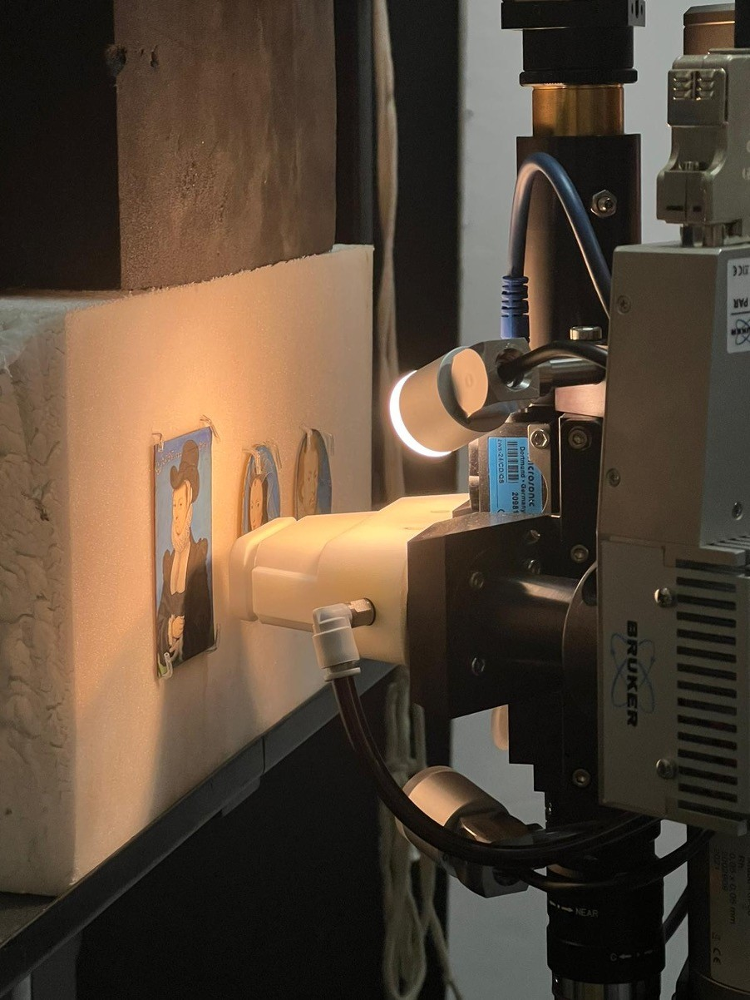

Technical research on miniatures was pioneered in the 1980s at the Victoria and Albert Museum in London through the work of the late Jim Murrell, the museum’s miniatures conservator at the time. Since then, the range of non-invasive analytical tools that can be applied to miniatures has grown considerably and now allows unprecedented insight into the material composition and the technical refinement of these miniature masterworks.

Our approach to technical and scientific examination of miniatures is grounded in the collaboration between researchers with expertise in conservation, art history and heritage science. We strive to engage with curators and conservators at the collecting institutions, to explore any research questions or conservation concerns they might have; and we collect as much information as possible on the objects prior to our analyses, including reports of previous conservation assessments or treatments, as well as published catalogue information. Within our team, we share both practical tasks and the following processing and interpretation of technical and analytical data.

Sixteenth- and seventeenth-century miniatures, painted on vellum with finely-ground pigments in a water-soluble medium, are essentially the same as manuscript illuminations in terms of their materials, minute details and conservation requirements. It’s because of this similarity that we can adapt the non-invasive analytical protocol we have been using for over a decade on manuscript illuminations to the technical study of miniatures.

Before a miniature can be subjected to scientific analysis, we need to establish whether it can be safely removed from its locket. This assessment is often completed in consultation with a conservator from the object’s home institution, who may be involved in the practical opening of the locket itself - a very lengthy and complex process at times, requiring patience and focus! 

*Figure 1: Miniature removed from its enamelled locket after removal of the metal pins securing the cover glass in place.*

Once a miniature has been removed from its locket, our investigation begins with technical imaging, which includes near-infrared, ultraviolet and raking light imaging, X-radiography, close observation under magnification and - most recently - X-ray Fluorescence (XRF) scanning. We then employ a range of point-specific methods, including Fibre-Optic Reflectance Spectroscopy (FORS), XRF spectroscopy, Raman spectroscopy and Fourier-Transform Infrared (FTIR) spectroscopy. All of these techniques provide complementary information and are most effectively used in combination with each other, both because they operate at different scales and because they each perform better in the analysis of a different range of materials. Most of these methods are briefly described in the Fitzwilliam Museum’s web resource on illuminated manuscripts; more detailed information can be found in numerous academic publications, many of which are freely available online.

Most of our work takes place in the analytical lab at the Fitzwilliam Museum and at the Hamilton Kerr Institute. In some cases, however, we have brought our instruments with us to  analyse miniatures at their home institutions. Our protocol has been adapted in each case, taking into account the practicalities of travelling with equipment, sometimes internationally, and the local availability of selected instrumentation. 

*Figure 2: XRF scanning of miniatures at the Hamilton Kerr Institute.*

