Further info on pigments listed here can be found in the [Pigment Compendium](https://www.taylorfrancis.com/books/mono/10.4324/9780080943596/pigment-compendium-ruth-siddall-nicholas-eastaugh-valentine-walsh-tracey-chaplin) and [Illuminated](https://www.fitzmuseum.cam.ac.uk/illuminated/lab/lab/overview-of-artists-materials).

## Azurite

A blue basic copper carbonate | Cu3(CO3)2(OH)2

Azurite is a mineral sourced from locations in Europe, including Germany, Hungary and France. It has been used as a pigment since the Middle Ages. Azurite pigment changes from deep blue towards grey the finer it is ground. It is therefore typically employed quite coarsely ground, which makes it challenging to achieve a smooth layer when brush-applied. A ‘floating in’ technique is employed for blue backgrounds, where the selected area is pre-wetted with a dilute application of azurite before a loaded brush is introduced to the surface. The pre-wetting helps the coarse azurite to float from the brush onto the vellum and settle thickly and evenly.

It is the typical blue pigment used to paint backgrounds and it is often employed in the blue draperies of miniatures.

    
    
    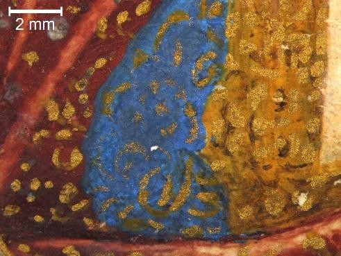

*B/MIN/12 (left), NPG 6947 (centre), RCIN 420022 (right)*

## Calomel / mercury white

Mercury(I) chloride | Hg2Cl2

Calomel is a white mineral that has been known since antiquity. By mixing sodium chloride, quicksilver, and vitriol (sulphuric acid), the corrosive mercuric chloride is obtained, transformed into mercurous chloride through a chemical reaction. Calomel blackens upon exposure to ammonia.

It has been identified in an increasing number of miniatures, especially in the paint passages corresponding to ruffs and collars.

    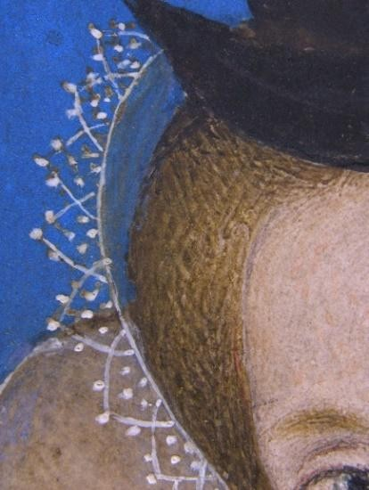
    
    

*FM 3868 (left), B/MIN/21 (centre), RCIN 420025 (right)*

## Earth pigments

General term for a family of natural pigments ranging in colour from red, to yellow, brown and black | Fe oxides and hydroxides, manganese oxides, clay minerals

Trace elements often found with earth pigments are titanium, calcium, potassium, magnesium

Natural earths and ochres were amongst the first colourants ever to be used by humans, as they can be used almost directly from the ground with little processing. They owe their range of colours to their variable content of iron and manganese oxides, and these variables also influence whether they are referred to as ochres, siennas or umbers.

Red and yellow earth pigments are typically found in mixtures with other pigments, for instance to paint hair and beard, or used as part of the orange preparatory layer for gold.

    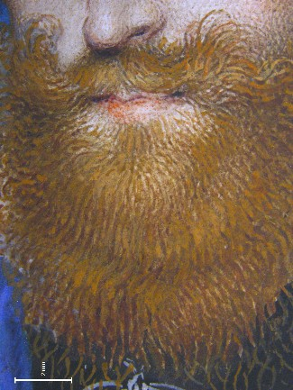
    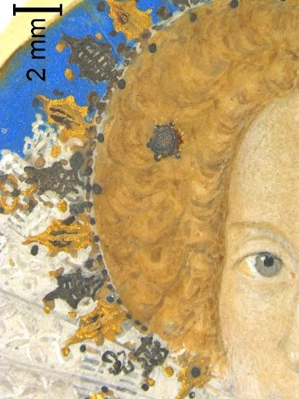
    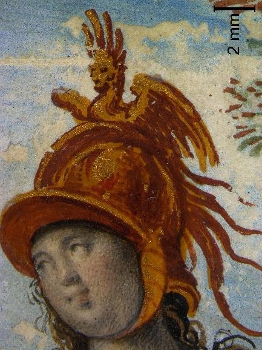

*FM 3869 (left), 29372 (centre), NPG 6947 (right)*

## Lead white

A basic carbonate of lead | 2PbCO3·Pb(OH)2

Up until the 17th century manufactured by placing strips of metallic lead in an environment rich in acetic and carbonic acid, lead white is chemically equivalent to the naturally occurring mineral hydrocerussite (2PbCO3·Pb(OH)2). Lead white paints usually also contain cerussite (PbCO3). While an extremely durable pigment, lead white has a tendency to darken when in contact with pollutants and several other colourants, notably those containing sulphides, such as orpiment and vermilion.

It is the preferred white pigment for mixtures to lighten the hue of other colour,s and it has been used on its own to paint white passages, such as ruffs. Lead white can be applied very thinly or bodied. An ability exploited in the depiction of pearls, lace ruffs and collars to suggest the actual texture of these expensive fabric.

    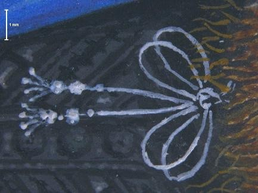
    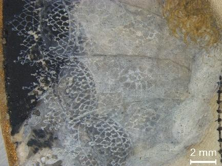
    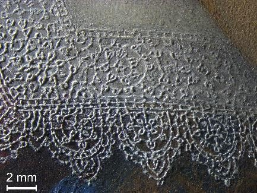

*FM 3869 (left), B/MIN/13 (centre), RCIN 420057 (right)*

## Lead tin yellow

Two yellow pigments containing lead and tin | Pb2SnO4 or Pb(Sn,Si)O3

Lead-tin yellow exists in two main forms: the so-called 'type I' – a lead stannate (Pb2SnO4) - and 'type II' – a lead tin oxide silicate (Pb(Sn,Si)O3). Lead-tin yellow type I is probably the yellow pigment most frequently used in European easel painting between the 15th and the first half of the 18th century. Less common, lead-tin yellow type II derives from the ancient glass industry and is first seen in use by painters in 13th century Florence.

Only lead tin yellow type I has been detected in miniatures so far, both in mixtures and applied in pure form. It can be used to paint draperies and is also often used to paint highlights in hair.

    
    
    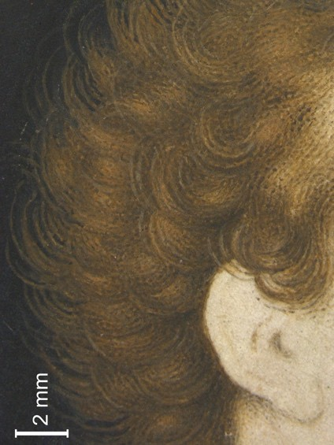

*106991 (left), NPG 6947 (centre), NPG 1572*

## Umber

See [Earth pigments](#earth-pigments).

## Silver

A precious, white metal

Silver can be applied as solid sheets of thinly beaten leaf, or finely ground to form a 'shell' colour that could be written or painted with. Unlike gold, silver has often tarnished and now appears black.

It is used to create jewellery and armoury, and to indicate the reflection on pearls.

    
    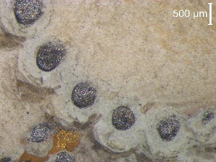
    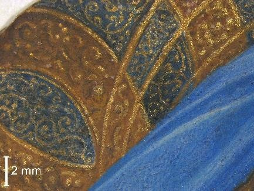

*FM 3902 (left), RCIN 420031 (centre), RCIN 420057 (right)*
