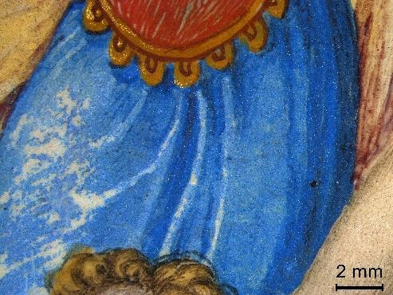
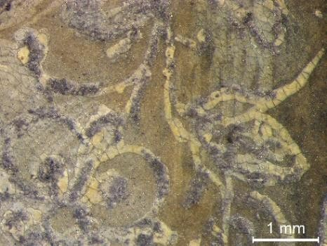
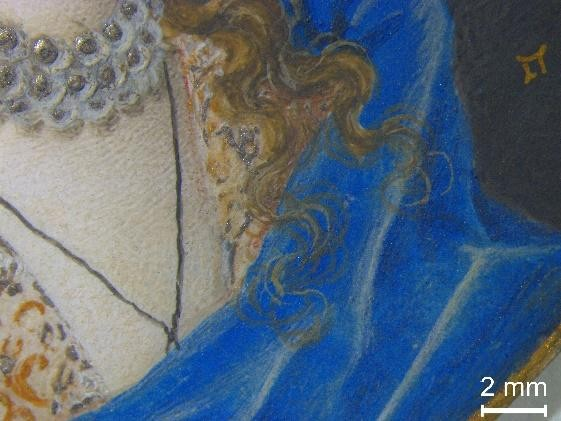
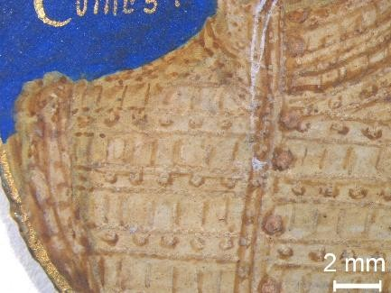
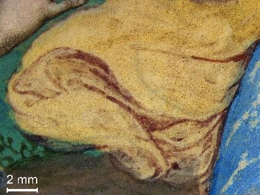

The entries on this page provide brief, introductory information about pigments and other materials and features found in the miniatures analysed during this project and in other published studies. 
Further information on pigments listed can be found in the following online resources:
[Pigment Compendium](https://www.taylorfrancis.com/books/mono/10.4324/9780080943596/pigment-compendium-ruth-siddall-nicholas-eastaugh-valentine-walsh-tracey-chaplin), [Illuminated](https://www.fitzmuseum.cam.ac.uk/illuminated/lab/lab/overview-of-artists-materials), [Artists’ Pigments, vol. 1](https://www.nga.gov/research/publications/pdf-library/artists-pigments-vol-1.html), [Artists’ Pigments, vol. 2](https://www.nga.gov/research/publications/pdf-library/artists-pigments-vol2.html), 
[Artists’ Pigments, vol. 3](https://www.nga.gov/research/publications/pdf-library/artists-pigments-vol-3.html)
Artists’ Pigments, vol. 4 (only available in print form). 

## Antlerite
See [Copper sulphates](#copper-sulphates)  

## Arsenic sulphides
Yellow, red and orange arsenic sulphide forms

Realgar (α-As4S4) is a reddish-orange pigment; it can easily transform into pararealgar (β-As4S4) as a result of a light-induced transition. This means that the change can take place on an object’s surface, and an intermediate phase between the two has frequently been identified on the miniatures analysed, especially in the orange preparatory layer under gilding, and occasionally in small details, such as orange floral decorations in the depicted clothing.  
Orpiment (As2S3), a yellow arsenic sulphide also used as a pigment, has not been identified in portrait miniatures so far.

     
    
   

<i>B/MIN/28 (left), FM 3902 (centre), FM 3902 (right)</i>

## Azurite

A blue basic copper carbonate | Cu3(CO3)2(OH)2

Azurite is a mineral sourced from locations in Europe, including Germany, Hungary and France. It has been used as a pigment since the Middle Ages. Azurite  changes from deep blue towards grey the finer it is ground. It is therefore typically employed quite coarsely ground, which makes it challenging to achieve a smooth layer when brush-applied. A ‘floating in’ technique is employed for blue backgrounds, where the selected area is pre-wetted with a dilute application of azurite before a loaded brush is introduced to the surface. The pre-wetting helps the coarse azurite to float from the brush onto the vellum and settle thickly and evenly.

It is the typical blue pigment used to paint backgrounds and it is often employed in the blue draperies of miniatures.

    
    
    

*B/MIN/12 (left), NPG 6947 (centre), RCIN 420022 (right)*

## Barium sulphate  
Barium sulphate     | 	BaSO4
 
Inert and non-poisonous white pigment that appeared on the artist’s palette from the late 18th century onwards. A naturally occurring barium sulphate is obtained from the mineral baryte, whereas the synthetic compound, synthesised from 1782 to offer an alternative to the toxic lead white, is called barium white or blanc fixe. The pigment has a moderate hiding power, and it can be used as a filler or substrate for lakes.
 
Barium sulphate is often used to retouch white areas in portrait miniatures, especially ruffs and laces. The naturally occurring baryte can occasionally be detected in association with the azurite pigment used on the backgrounds. 

## Bone black 
See [Carbon-based black](#carbon-based-black)

## Brochantite
See [Copper sulphates](#copper-sulphates)

## Calcium-based whites
A number of historic white pigments are based on calcium compounds

White pigments could consist of calcium carbonate obtained from chalk, limestone, crushed eggshells or mollusc shells (CaCO3). Naturally occurring calcium sulphate dihydrate (CaSO4·2H2O) is gypsum. Calcium compounds are abundant in nature but they are not commonly used as white pigments.
Chalk is often found in portrait miniatures as a filler for lead white and as part of the composition of earth pigments. Calcium compounds could also be part of the manufacturing process of indigo and red lake pigments.
 

## Calomel / mercury white

Mercury(I) chloride | Hg2Cl2

Calomel is a white mineral that has been known since antiquity. It was produced for medicinal purposes by mixing sodium chloride, quicksilver, and vitriol (sulphuric acid) to make the corrosive mercuric chloride (HgCl2), which could then be transformed into mercurous chloride (Hg2Cl2) through a chemical reaction. Calomel blackens upon exposure to ammonia.
 
It has been identified in an increasing number of miniatures, especially in the paint passages corresponding to ruffs and collars, and is most likely the ‘quicksilver white’ Nicholas Hilliard mentions in his treatise on <i>The Arte of Limning</i>. 

    
    
    

*FM 3868 (left), B/MIN/21 (centre), RCIN 420025 (right)*

## Carbon-based black
General term for a number of black pigments composed primarily of elemental carbon, including chars from ivory, bone and vines, and the soot of lampblack.

Readily available, black pigments based on elemental carbon have been used by artists across the globe since prehistoric times.
Carbon-based blacks were often mixed with lead white to obtain a broad range of grey shades varying in hue from bluish to brownish. Bone black was widely used by limners in the mid-16th – early 17th century to paint black paint passages such as doublets and hats. 

## Cerulean blue
Cobalt stannate     | 	Co2SnO4
 
This artificial blue pigment was synthetically produced at the end of the 18th century but became available to artists only in the 1860s. It is stable and lightfast but has a limited opacity.
 
It has been found occasionally in the blue backgrounds in portrait miniatures where it has been used to retouch losses or damages. 

## Chalk
See [Calcium-based whites](#calcium-based-whites)
 
## Chromium oxide greens
Chromium oxide and hydrated chromium oxide 	| 	Cr2O3 and Cr2O3·2H2O
 
Chromium oxide is an opaque, olive green pigment believed to have been introduced to the artist’s palette in 1862. The hydrated form, also known as viridian, is a transparent pigment with a colder and bluish hue put into commercial production in 1859.
 
Chromium oxide greens have been used as a retouching material in portrait miniatures.

 
## Cinnabar and vermilion
Mercury sulphide 	|     HgS

Cinnabar is a naturally occurring mercury sulphide often found in association with elemental mercury, heavy metal sulphides, and other minerals; the red ore is ground, washed and heated until all the impurities are removed. Its main European source was Spain, where the mines at Almaden had been active since antiquity. Its synthetic equivalent is called vermilion, and by the Middle Ages its manufacture was well established.
The natural and synthetic pigments cannot be easily distinguished with the analytical methods used for this project; as the most likely form to have been used is vermilion, this term is used throughout this website.

Vermilion has been widely identified in portrait miniatures, both unadulterated and in mixtures. It is one of the main red components in flesh tones and lips, sometimes used to outline the face, and it is also identified in red details on clothing. Vermilion is the only red pigment found to have been used to paint the diamonds and hearts of the playing cards functioning as supports for miniatures.

    
    
    

<i>AGOID.29736 (left), NPG 4852 (centre), NT 1183954 (right)</i>

## Cobalt blue
Cobalt and aluminium oxide	|     CoO·Al2O3
 
The synthetic blue pigment was manufactured in 1803 by Louis Thénard and put into commerce as a pigment soon after; although costly, it is stable and it was used to replace smalt and mineral blues.
 
Cobalt blue is often found in retouchings in the blue background of the miniatures.  
 

## Copper-based pigment 
See [Azurite](#azurite), [Malachite](#malachite), [Copper sulphates](#copper-sulphates), [Copper chlorides](#copper-chlorides)

## Copper carbonate
See [Azurite](#azurite) (blue form) and [Malachite](#malachite) (green form) 
 
## Copper chlorides
A number of green copper-based compounds of natural and synthetic origin
 
Copper chlorides, including atacamite (Cu2(OH)3Cl), clinoatacamite, paratacamite and botallackite, are relatively rare minerals found around copper deposits. They can be synthetically manufactured or occur as corrosion products of natural copper minerals, such as azurite and malachite.  
 
Copper chlorides have not been commonly detected in portrait miniatures, but atacamite is identified in a couple of objects associated with Isaac Oliver and Nicholas Hilliard’s studios and used to paint green details in draperies and landscapes.

 
## Copper sulphates
A number of green copper-based compounds of natural origin

This family of minerals, which includes brochantite (Cu4SO4(OH)6), antlerite (Cu3SO4(OH)4) and posnjakite (Cu4SO4(OH)6•H2O), appears to have been used by artists to paint illuminated manuscripts and paintings both North and South of the Alps, particularly in Italy and the Low Countries, in the 15th and 16th centuries.
Brochantite has been identified on several portrait miniatures in the mint green passages in landscapes and details on clothing.

    
    
    

<i>NPG 6947 (left), NMB 976 (centre), MIN 0102 (right)</i>

## Drying oil
Glycerolipids (polyunsaturated fatty acids)
 
Drying oils containing polyunsaturated fatty acids, such as linseed oil, have been used as a binding medium for painting since the Middle Ages. The oxidation of the triglycerides following chemical reactions with oxygen and the crosslinking through the oil structure are essential in the formation of a solid and durable film.
 
Portrait miniatures are usually painted with gum arabic; however, a lipidic binder likely associated with a drying oil is detected in some paint passages and especially in retouched areas.

## Earth pigments

Iron-containing natural pigments  	|     Iron oxides and hydroxides, manganese oxides, clay minerals 
 
Natural earths were amongst the first colourants ever to be used by humans, as they are readily available directly from the ground and need little processing. They owe their range of colours to their variable content of iron and manganese oxides, and these variables also influence whether they are referred to as ochres, siennas or umbers.
 
Red and yellow earth pigments are typically found in mixtures with other pigments, for instance to paint hair and beards, or used as part of the orange preparatory layer for gold detailing. Manganese-rich umbers are commonly used in darker brown regions and for modelling of hair. Trace elements often found with earth pigments are titanium, calcium, potassium and silicon. 

    
    
    

*FM 3869 (left), 29372 (centre), NPG 6947 (right)*

## Emerald green 
Hydrated copper arsenites

Scheele’s green was developed by the Swedish chemist Carl Scheele in 1778. 
Emerald green, also called Schweinfurt green, was first produced commercially in 1814 and used as an artists’ pigment from the 1830s. 

Copper arsenites are seldom identified as retouched materials in portrait miniatures, most likely due to the lack of green areas in these objects.  

## Green organic colourants
Green colourant extracted from plants
 
An organic green colourant, or sap green, is obtained from the flavonoid dye extracted from the ripe berries of various species of <i>Rhamnus</i> (i.e., buckthorn). Some recipes indicate the addition of indigo/woad in order to obtain the desired green colour.
 
Green colourants are sporadically used to paint small, embroidered details on clothing, such as stems and leaves.

## Goethite
See [Earth pigments](#earth-pigments)
 
## Gold
Precious, yellow metal
 
Gold could be applied as thinly beaten solid sheets (gold leaf) or as a paint of finely ground gold leaf ('shell' gold) in an aqueous binder, commonly a gum. 
Shell gold application is the typical technique employed in portrait miniatures, in which powdered gold is mixed with a binding medium in a seashell and applied on the surface of the object with a brush.
 
Gold is used extensively in portrait miniatures to paint jewellery, usually applied over an orange or yellow preparatory layer similar to the ‘bole’ used in paintings. It is also applied to embellish clothing, to write monograms and inscriptions on the backgrounds, and as a golden border along the outer edge of miniatures.  

    
    
    

<i>B/MIN/28 (left), NPG 6947 (centre), RCIN 420031 (right)</i>

## Gum arabic
A polysaccharide-based material obtained from the sap of two species of the Acacia tree
 
Gum arabic is the best-known of a range of vegetable gums widely used as paint binders. Their preparation is described in detail in historic treatises, which also mention a variety of additions - including honey and sugar - to improve their workability and effectiveness.

In his treatise, Nicholas Hilliard gives instruction on binding pigments with the right amount of gum arabic for miniature painting, and gum has been identified on several Isaac Oliver miniatures using FT-IR analysis. 
 
 
## Hematite
See [Earth pigments](#earth-pigments)
 
## Indigo/woad
Blue dyes extracted from the processed leaves of two species of plants

Indigo is derived from <i>Indigofera</i> plants native to India, especially <i>Indigofera tinctoria</i>, while woad is extracted from the leaves of <i>Isatis tinctoria</i> plants, native to central Asia and widely cultivated across Europe. Chemically identical to one another, these two dyes yield a deep blue colour. Indigo and woad cannot be distinguished with the analytical methods used for this project.
Pure indigo has not been identified in portrait miniature paint passages so far, but it is the main blue pigment used in mixtures with other colourants to obtain a purple, for instance in doublets and backgrounds. It has also been identified in mixtures with lead white to create shadows in ruffs, or with yellow pigments to colour green passages.
 

## Lapis lazuli
See [Ultramarine blue](#ultramarine-blue)

## Lead-based pigments
See [Lead white](#lead-white) or [Minium and red lead](#minium-and-red-lead) 

## Lead-tin yellow
Two yellow pigments containing lead and tin | Pb2SnO4 or Pb(Sn,Si)O3

Lead-tin yellow exists in two main forms: the so-called 'type I' – a lead stannate (Pb2SnO4) - and 'type II' – a lead tin oxide silicate (Pb(Sn,Si)O3). Lead-tin yellow type I is probably the yellow pigment most frequently used in European easel painting between the 15th and the first half of the 18th century. Less commonly used, lead-tin yellow type II derives from the ancient glass industry and is first seen in use by painters in 13th century Florence.

Only lead-tin yellow type I has been detected in miniatures so far, both in mixtures and applied unadulterated. It can be used to paint draperies and is also often used to paint highlights in hair.

    
    
    

*106991 (left), NPG 6947 (centre), B/MIN/12 (right)*

## Lead white
A basic carbonate of lead | 2PbCO3·Pb(OH)2

Up until the 17th century manufactured by placing strips of metallic lead in an environment rich in acetic and carbonic acid, lead white is chemically equivalent to the naturally occurring mineral hydrocerussite (2PbCO3·Pb(OH)2). Lead white paints usually also contain cerussite (PbCO3). While an extremely durable pigment, lead white has a tendency to darken when in contact with pollutants and several other colourants, notably those containing sulphides, such as orpiment and vermilion.

It is the preferred white pigment for mixtures to lighten the hue of other colour,s and it has been used on its own to paint white passages, such as ruffs. Lead white can be applied very thinly or bodied, a feature exploited in the depiction of pearls, lace ruffs and collars to suggest the actual texture of these expensive fabric.

    
    
    

*FM 3869 (left), B/MIN/13 (centre), RCIN 420057 (right)*

## Malachite
A green basic copper carbonate 	|      Cu2CO3(OH)2

Malachite is a common mineral often found in association with azurite; it yields a vivid turquoise green but is reduced to a pale green if ground too finely.
Malachite has been identified in green passages of landscapes and foliage and often in conjunction with other types of green pigments.

    
    
    

<i>MIN 0102 (left), NT 1183954 (centre), KMS 6938 (right)</i>

## Minium and red lead
Orange-red lead tetroxide 	|     Pb3O4

Minium is a naturally occurring orange-red mineral. Its synthetic analogue is called red lead. They cannot be easily distinguished with the analytical methods used for this project; the term red lead is used throughout this website as the most likely form to have been used.
Red lead is often found in portrait miniatures as one of the main red components in flesh tones and lips, or as a base layer for orange details in clothing.

    
    
    

<i>FM 3869 (left), NMB 973 (centre), KMS 6938 (right)</i>

## Orpiment
See [Arsenic sulphides](#arsenic-sulphides)
 

## Pink colourants and lakes 
See [Red organic colourants](#red-organic-colourants-and-lakes) 
 
## Playing card
Pasteboard

Playing cards were typically used as the back support for portrait miniatures, onto which a piece of vellum was glued. In some cases, Isaac Oliver used contemporary rouennais cards, including court cards, of the four suits (hearts, spades, diamonds, clubs). It has been proposed that the choice of playing card may hold significance in some cases. The majority of miniatures investigated have had further support layers added to the back, which obscures the original playing card back.

## Prussian blue 
Iron(III)-Hexacyanoferrate(II)   |    Fe(III)4[Fe(II)(CN)6]3

Dark blue pigment obtained by synthesis. It was accidentally discovered around 1710 and widely produced since then. It has a high hiding power and often contains adulterants like plaster, alumina, zinc white. 

This pigment is found in retouched areas corresponding to the blue background of the miniatures, often mixed with other blue pigments. 

## Realgar
See [Arsenic sulphides](#arsenic-sulphides)
 
## Red organic colourants and lakes
Red colourants extracted from plants and animals can be painted directly as a dye, or further processed and precipitated onto an inorganic substrate to form a 'lake' pigment that can be stored for later use.

The most common plant-based red dyes were madder, harvested from the root of <i>Rubia tinctorum</i>, and shredded Brazilwood from <i>Caesalpinia echinata</i>. Folium, obtained from <i>Chrozophora tinctoria</i>, produces a number of hues ranging from red to purple and blue, depending on its preparation.
Insect-based colourants yield a wide range of colours from deep red through to violet purple. The most precious insect pink, Kermes (also known as Polish cochineal), was the main source of insect colour in Europe prior to the 1520s. It was swiftly sidelined when cochineal from the Americas took over as the preferred insect dye. Lac, a resinous secretion from scale insects of the family <i>Coccoidea</i>, was collected across Asia. 
Non-invasive scientific analyses can distinguish between plant and insect-based colourants, but not the source. 

Red organic colourants are used extensively for red backgrounds for Isaac Oliver’s miniatures (insect-based); a more brownish red colourant is used routinely for the dark line between lips.

    
    
    

<i>B-MIN-12 (left), FM 3865 (centre), NMB 976 (right)</i>

## Silver
A precious, white metal
 
Silver can be applied as solid sheets of thinly beaten leaf, or finely ground and bound in a gum arabic binder (‘shell’ silver) to create a silver paint. Unlike gold, silver tends to tarnish and now appears black in the vast majority of cases.
 
In portrait miniatures silver is always applied as ‘shell’ silver. It is used to create jewellery and features on armour and clothing, and to indicate the reflection on pearls.

    
    
    

*FM 3902 (left), RCIN 420031 (centre), RCIN 420057 (right)*

## Smalt
A blue pigment obtained by grinding a cobalt-containing potash glass

Smalt was not commonly used by artists but because of its low cost, it became popular amongst easel painters from  the late 16th century onwards. Its manufacture then became a specialty of the Dutch and Flemish.
Smalt has been detected in landscapes, especially where buildings are evident. It often appears to have discoloured to a pale grey.

    
    
    

<i>KMS 6938 (left), NPG 6947 (centre), MIN 0102 (right)</i>

## Synthetic ultramarine
See [Ultramarine blue](#ultramarine-blue)
 
## Titanium white 
Titanium dioxide     |     TiO2

Titanium oxide exists in two main isomorphic forms: anatase and rutile. A third form, brookite, is rarer. They occur naturally, although anatase is rare and the mineral form does not appear to have been used as a pigment. In contrast, the use of mineral rutile, which is also found as an impurity in azurite and earth pigments, cannot be ruled out. 
However, titanium white pigments were produced by synthesis in the 20th century. Anatase has been synthesised in the 1910s, while rutile, which came onto the market in 1937, became the preferred form, as it possesses superior qualities, such as a better hiding power and stability. 

Titanium white has seldom been identified in portrait miniatures in retouched areas. This may be explained by a change in attitude towards applying retouching, which has been undertaken with decreasing frequency in the 20th century.

## Ultramarine blue
A blue pigment that, until a synthesis method was developed, was obtained by purifying ground lapis lazuli stones.

This precious pigment was derived by a lengthy process which enabled the extraction of the bright blue mineral lazurite, a complex sulphur-containing sodium aluminium silicate (Na8-10Al6Si6O24S2-4), from lapis lazuli stones mined in Afghanistan. Its exotic provenance earned the pigment its common name, which means 'beyond the sea'. Despite its cost, ultramarine was lavishly used by medieval and Renaissance illuminators and painters. 
Synthetic ultramarine, manufactured since c.1830, has the same chemical composition as the natural product. The two cannot be easily distinguished using the analytical methods employed for this project. However, unless there were specific reasons to suspect a modern origin for the ultramarine used in one of the miniatures (such as clear damage to the paint layer, which may have prompted a past 'restoration' treatment), it is assumed here that the pigment identified is natural ultramarine.
Ultramarine blue is sporadically found in the blue backgrounds of portrait miniatures, sometimes used to shade the azurite background, to create an optical blue effect in white collars, or to paint small details in clothing. 

    
    
    

<i>RCIN 420933 (left), NPG 6947 (centre), FM 3869 (right)</i>

## Umber
See [Earth pigments](#earth-pigments)

## Vellum
Animal skin
 
The type of vellum used to paint portrait miniatures consisted of ‘virgin parchment’, indicating young animals that never bore hair, called ‘abortive’ vellum by Hilliard. The vellum was glued to the pasteboard (playing card) with starch and burnished until the surface appeared smooth and white.

## Yellow organic colourants and lakes
Organic yellows are usually derived from plant sources. Very prone to fading following exposure to light, they cannot be securely distinguished using non-invasive analytical methods.
Weld, also known as 'fuller's weed' or 'dyer's weed', was derived from <i>Reseda luteola</i> plants and widely used in textile production. Saffron, the golden yellow dye extracted from the stamens at the centre of the <i>Crocus sativus</i> flower, was labour intensive to harvest and very expensive.

Yellow dyes and lakes are likely to have been used in portrait miniatures, for instance in mixture with green and blue pigments, but they have not been securely identified. 
 
 

## Zinc white
Zinc oxide 	| 	ZnO
 
This compound was synthetically produced in the 1780s and widely commercialised from 1834 as a white pigment alternative to the toxic lead white. A natural occurrence exists, called zincite, although only the synthetic equivalent is likely to have been used as a pigment. It is lightfast and opaque, but quickly tends to saponify in oil binders, hardening the pictorial film. Titanium white replaced zinc white in the 1920s, due its better stability and hiding power. 
 
Zinc white has been extensively used for retouching in portrait miniatures, often mixed with coloured pigments to modulate the hue.

